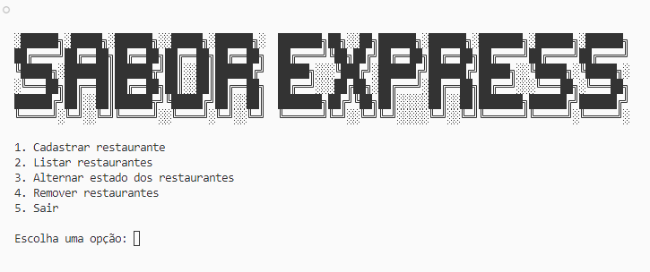
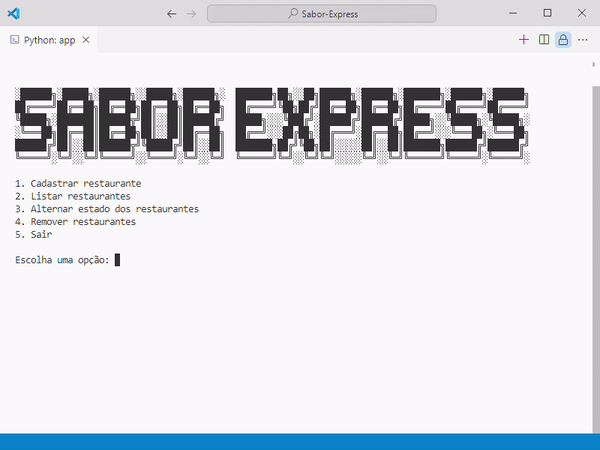

# Sabor Express

O seguinte repositório faz parte do curso **Python: crie sua primeira aplicação** da [Alura](alura.com.br).

Data de conclusão: 15/03/2024

Carga horária: **8h**

* Crie um projeto em Python usando o VSCode
* Descubra o fluxo de uma aplicação com o uso de condicionais e laços de repetição
* Aprenda a utilizar blocos de controle de execução try-except
* Crie funções para mostrar o menu principal e registrar restaurantes em listas e dicionários

link do curso: [Python: crie a sua primeira aplicação](https://cursos.alura.com.br/course/python-crie-sua-primeira-aplicacao "Curso Alura")

 

---

## Aplicativo

O aplicativo criado foi uma ideia simples de aplicativo de cadastro chamado **"Sabor Express"**, para aprender as funções de Python através do cadastramento, listagem, alternação de estado e remoção de um dicionário. Visto formatação de strings, manipulação de interface via terminal e noções básicas de sintaxe e estruturas.

Este desenvolvimento tem como objetivo servir de base apara aprendizagem visando posteriormente migrar para uma estrutura de Python OO (Orientado à objetos).



## Funcionamento

Faz os cadastro, listagem, alternação estados e remoção dos restaurantes através de funções dedicadas, mostrando via terminal com estilização.

Possui um dicionário com as informações dos restaurantes.

```python
# Lista de Restaurantes
restaurantes = [{'nome':"Manu's Risottos",'categoria':'Risotos', 'ativo':True},
                {'nome':"Pizzaranria",'categoria':'Pizzaria', 'ativo':True},
                {'nome':"Merdeiro",'categoria':'Hamburgueria', 'ativo':True}, 
                {'nome':"Slomphies",'categoria':'Smoothieria', 'ativo':False}]
```

Lista as opções em um menu e realiza a função respectiva de cada uma.

```python
    try:
        opcao_escolhida = int(input('Escolha uma opção: '))

        match opcao_escolhida:
            case 1:
                cadastrar_novo_restaurante()
            case 2: 
                listar_restaurantes()
            case 3: 
                alternar_estado_restaurante()
            case 4:
                remover_restaurantes()
            case 5: 
                finalizar_app()
            case _:
                opcao_invalida()
    except: 
        opcao_invalida()

```

### Cadastrar restaurante

Cadastra o restaurante dentro do dicionário.

```python
def cadastrar_novo_restaurante():
    '''Essa função é responsável por cadastrar um novo restaurante 
  
    Inputs:
    - Nome do restaurante
    - Categoria

    Outputs:
    - Adiciona um novo restaurante a lista de restaurantes'''
    limpar_console()
    exibir_subtitulo('1. Cadastrar restaurante:')
  
    nome = input('\tDigite o nome do restaurante: ')
    categoria = input(f'\tDigite o nome da categoria do restaurante {cor_texto.BOLD}{nome}{cor_texto.END}: ')
    dados_restaurante = {'nome':nome,'categoria':categoria,'ativo':False}
    restaurantes.append(dados_restaurante)
    print(f'\n\tO restaurante {cor_texto.BOLD}{cor_texto.GREEN}{nome}{cor_texto.END} foi cadastrado com sucesso!')
    print('\tCaso deseje ativa-lo, retorne ao menu principal e selecione a opção 03 ("Ativar restaurantes").')
    voltar_ao_menu_principal()
```


### Listar restaurantes

Lista os restaurantes existentes com sua categoria e seu estado (Em funcionamento ou Desativado).

```python
def listar_restaurantes():
    '''Lista os restaurantes presentes na lista 
  
    Outputs:
    - Exibe a lista de restaurantes na tela'''
    limpar_console()
    exibir_subtitulo('2. Listar restaurantes:')
    i=0
    for restaurante in restaurantes:
        i+=1
        print(f'\t[{i}] restaurante: \033[1m{restaurante['nome']}\033[0m')
        print(f'\t\tCategoria: {restaurante['categoria']}')
        if restaurante['ativo'] == True:
            print(f'\t\t{cor_texto.BLUE}Em funcionamento!{cor_texto.END}')
        else:
            print(f'\t\t{cor_texto.GREY}Desativado{cor_texto.END}')
        print('')
    
    voltar_ao_menu_principal()

```


### Alternar estados dos restaurantes

Altera o dicionário invertendo o estado de um restaurante (De desativado para ativo).

```python
def alternar_estado_restaurante():
    '''Altera o estado ativo/desativado de um restaurante 
  
    Outputs:
    - Exibe mensagem indicando o sucesso da operação'''
    limpar_console()
    exibir_subtitulo('3. Alternar estado dos restaurantes:')
    nome = input('Digite o nome do restaurante que deseja alterar o estado: ')
    restaurante_encontrado = False
  
    for restaurante in restaurantes:
        if nome == restaurante['nome']:
            restaurante_encontrado = True
            restaurante['ativo'] = not restaurante['ativo']
            mensagem = f'O restaurante {cor_texto.BOLD}{nome}{cor_texto.END} foi {cor_texto.BOLD}{cor_texto.BLUE}ativado{cor_texto.END} com sucesso!' if restaurante['ativo'] else f'O restaurante {cor_texto.BOLD}{nome}{cor_texto.END} foi {cor_texto.BOLD}{cor_texto.GREY}desativado{cor_texto.END} com sucesso!'

    if not restaurante_encontrado:
        print('\n\tRestaurante não encontrado!')
        print('\nDigite 3 para tentar novamente. ')
        escolha = str(input('Digite qualquer tecla para voltar ao menu principal. '))
        if escolha == '3':
            alternar_estado_restaurante()
        else:  main()

    print(mensagem)
    voltar_ao_menu_principal()
```



### Remover restaurante

Remove um restaurante caso ele esteja desativado.

```python
def remover_restaurantes():
    '''
    Remove restaurantes da lista
  
    Outputs:
    - Exibe mensagem indicando o sucesso da operação'''
    limpar_console()
    exibir_subtitulo('4. Remover restaurantes:')
    nome = input('Digite o nome do restaurante que deseja remover: ')
    restaurante_encontrado = False
    restaurante_ativo = False
    for restaurante in restaurantes:
        if nome == restaurante['nome']:
            restaurante_encontrado = True
            if restaurante['ativo'] == True:
                restaurante_ativo = True
            else:
                restaurantes.remove(restaurante)
                print(f'O restaurante {cor_texto.BOLD}{nome}{cor_texto.END} foi {cor_texto.BOLD}{cor_texto.RED}removido{cor_texto.END} com sucesso!')

    if not restaurante_encontrado:
        print('\n\tRestaurante não encontrado!')
        print('\nDigite 4 para tentar novamente. ')
        escolha = str(input('Digite qualquer tecla para voltar ao menu principal. '))
        if escolha == '4':
            remover_restaurantes()
        else: main()
    elif restaurante_ativo == True:
            print('\n\tRestaurante ainda está ativo!')
            print('\nDigite 3 para ir à alteração de estado. ')
            escolha = str(input('Digite qualquer tecla para voltar ao menu principal. '))
            if escolha == '3':
                alternar_estado_restaurante()
            else: main()
    else: voltar_ao_menu_principal()
```


